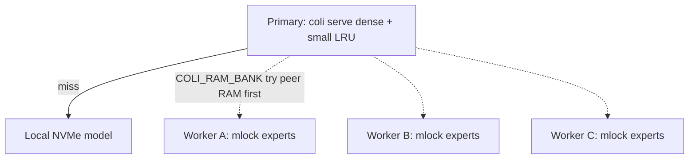

# Pooled RAM — one GLM-5.2 across many old PCs

**Goal:** treat several Proxmox/LAN machines as **one larger expert cache** for a
**single** Colibrì decode, instead of only running independent copies
([proxmox-cluster.md](proxmox-cluster.md)).

**ColbriButBuffed experimental path:** `tools/ram_pool/` + optional
`COLI_RAM_BANK=host:port,...` in the engine.

## Honest physics (read this first)

| Idea | Reality on typical old gear (1 GbE) |
|------|-------------------------------------|
| “Add the RAM numbers together and the model fits” | Experts are still **~350 GB**. 4×16 GB free ≈ **64 GB** of pin room — helpful, not full residency. |
| “Share RAM like one big PC” | Linux does **not** give Colibri a unified address space across hosts. We **pin experts on peers** and fetch (or, later, compute) over the network. |
| Fetch expert weights from peer RAM | A coalesced expert is **~19 MB**. At ~100 MB/s that is **~0.2 s** per miss. Local **NVMe** is often **faster**. Pooling **wins** mainly when the primary is **swap-thrashing** or the model disk is slow. |
| What actually scales on Gigabit | **Remote compute** (send activations ~KB, peer runs the expert matmul). That needs engine/worker kernels — designed below, not a full production path yet. |



## What we ship

1. **`tools/ram_pool/worker.py`** — on each old box: open the **same** Colibri model
   directory (local copy or read-mostly), **mlock** as many experts as `BUDGET_GB`
   allows, serve them over TCP.
2. **`tools/ram_pool/coordinator.py`** — given `host=budget_gb` list, print a stable
   expert→worker assignment and example env lines.
3. **`tools/ram_pool/bench.py`** — measure local `pread` vs bank fetch on *your* LAN.
4. **Optional engine hook** — if `COLI_RAM_BANK` is set, `expert_load` tries the bank
   before disk for the coalesced weight slab (+ scales). Unset = zero behavior change.

## When to use this vs capacity cluster

| Situation | Use |
|-----------|-----|
| Many users, each OK with slow replies | [proxmox-cluster.md](proxmox-cluster.md) capacity LB |
| One chat, primary RAM exhausted / swapping | Try **RAM pool** (this doc) |
| Want one reply much faster on 1 GbE | Need **more RAM on one node**, or wait for remote-compute workers |
| 10/25/40 GbE + lots of peer RAM | Weight bank becomes more plausible — **bench first** |

## Setup (Proxmox / Linux)

### Per worker (old PC)

```bash
# Local model copy on that node (same int4 Colibri container as the primary)
export MODEL=/models/glm52_i4
export BUDGET_GB=8          # leave headroom for the OS
export BIND=0.0.0.0:9400
python3 tools/ram_pool/worker.py
```

Or systemd: `scripts/proxmox/ram-pool-worker.service`.

### Primary (runs `coli serve`)

```bash
# After coordinator printout, or manually:
export COLI_RAM_BANK=10.0.0.21:9400,10.0.0.22:9400,10.0.0.23:9400
cd c
python3 coli serve --model /models/glm52_i4 --policy lowspec --host 0.0.0.0
```

Rebuild the engine from this tree so `COLI_RAM_BANK` is recognized (release
binaries older than this fork ignore it and just use disk).

### Assign budgets

```bash
python3 tools/ram_pool/coordinator.py \
  --experts 19456 \
  --node 10.0.0.21=8 \
  --node 10.0.0.22=6 \
  --node 10.0.0.23=10
```

### Bench your fabric

```bash
python3 tools/ram_pool/bench.py --model /models/glm52_i4 \
  --bank 10.0.0.21:9400 --samples 20
```

If bank latency ≫ local NVMe, keep the pool only as a **swap-avoidance** assist,
or invest in faster interconnect / remote compute.

## Protocol (v1 — weight bank)

TCP, one connection per fetch (simple; enough for experiments):

```
→  GET <layer> <eid>\n
←  OK <wtot> <ftot>\n
←  <wtot bytes weight slab><ftot*4 bytes scales>
←  ERR <message>\n
```

Workers store the **same contiguous gate/up/down weight order** the engine uses for
coalesced `pread` (sorted by file offset), plus the three `.qs` scale blobs.

Routing: `worker_index = (layer * 1315423911 + eid) % N` (same in coordinator and C).

## Roadmap — true “shared brain” on Gigabit

1. **Now:** peer **RAM as expert weight cache** (this doc).
2. **Next:** `ram_pool` **compute** workers — primary sends hidden state; peer runs
   int4 expert GEMM with resident weights; returns output activations (~KB on wire).
3. **Not planned:** pretending Ceph/NFS is shared RAM for decode.

## Related

- [proxmox-cluster.md](proxmox-cluster.md) — concurrent multi-serve fleet
- [lowspec.md](lowspec.md) — single-node 25–64 GB policy
- Upstream Colibrì: https://github.com/JustVugg/colibri
