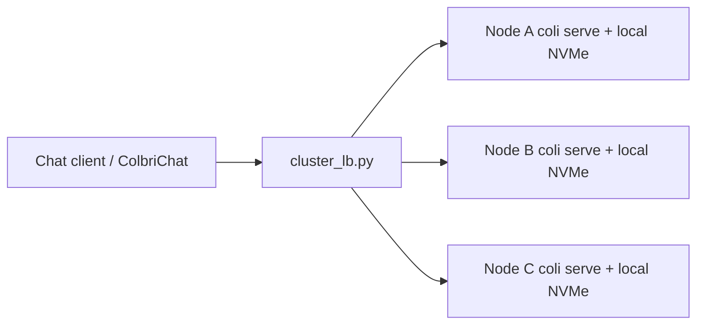

# Proxmox cluster — GLM-5.2 with ColbriButBuffed

**What this is:** run **one full Colibri engine per Proxmox node** (or VM), each with a
**local NVMe copy** of the GLM-5.2 int4 container, and put a small OpenAI-compatible
**load balancer** in front. Clients talk to one URL; the fleet absorbs concurrent chats.

**What this is not:** splitting *one* token’s expert matmuls across PCs. Colibrì is a
single-process memory hierarchy (disk → RAM → VRAM). Network-sharding experts would need
a new RPC engine path and would usually be *slower* than local NVMe on a 33 GB box.

## Honest expectations

| Goal | Supported? | How |
|------|------------|-----|
| More **concurrent** users | Yes | N independent `coli serve` + LB |
| Faster **single** reply | Mostly no | Need more RAM/VRAM *on one node*, or a smaller model |
| Shared Ceph/NFS model dir | Avoid | Expert I/O over the network kills tok/s |
| One decode across nodes | Experimental | Peer **RAM pool** for expert pins — [pooled-ram.md](pooled-ram.md). Not a unified address space; Gigabit often loses to local NVMe unless the primary is swapping. |

Per-node speed still follows [lowspec.md](lowspec.md): on 25–64 GB RAM, disk-bound
decode is often **&lt;1 tok/s** cold. The cluster multiplies *capacity*, not that rate.



## Recommended topology

1. **Proxmox cluster** of PCs (corosync/pve as usual).
2. On **each** compute node (bare metal or a VM with local disk):
   - **≥32 GB RAM** guest (64 GB better)
   - **≥400 GB local NVMe** for the model (virtio-scsi on a local LVM-thin/ZFS dataset, or PCI passthrough of the NVMe)
   - **Do not** put `C:\glm52_*` / `/models/glm52` on CephFS/NFS for decode
3. One **gateway** VM (small): runs `tools/cluster_lb.py`, points at the node backends.
4. Optional: HAProxy/nginx instead of the Python LB if you already operate one.

### Disk layout (per node)

| Path | Contents |
|------|----------|
| `/models/glm52_i4` (or `C:\glm52_ablit`) | Full Colibri int4 container (~350–380 GB) **local** |
| model `.coli_usage` / `.coli_kv` | Stay on that same local volume (warm pins are per node) |

Each node keeps its own warm cache. Sticky sessions help a bit (same client → same
backend) but are optional; the LB defaults to **least-busy** by `/health` scheduler.

## Node setup (Debian/Ubuntu VM)

```bash
# On each inference VM — after cloning ColbriButBuffed and installing Python 3:
sudo mkdir -p /models/glm52_i4
# Download once per node onto LOCAL disk (hours):
hf download mastouri/GLM-5.2-colibri-int4-g64-with-int8-mtp --local-dir /models/glm52_i4

cd /path/to/ColbriButBuffed/c
python3 coli doctor --model /models/glm52_i4 --policy lowspec
# Listen on the cluster network, not only loopback:
python3 coli serve --model /models/glm52_i4 --policy lowspec \
  --host 0.0.0.0 --port 8000
```

Or install the systemd unit from this repo:

```bash
sudo cp scripts/proxmox/coli-serve.service /etc/systemd/system/
# Edit Environment= paths in the unit, then:
sudo systemctl daemon-reload
sudo systemctl enable --now coli-serve
```

Bootstrap helper (paths/user editable):

```bash
sudo bash scripts/proxmox/bootstrap-node.sh /models/glm52_i4
```

Firewall: allow **8000/tcp** from the gateway only; allow **8080/tcp** (LB) from clients.

## Gateway load balancer

```bash
# On the small gateway VM (stdlib Python only):
export COLI_BACKENDS=http://10.0.0.11:8000,http://10.0.0.12:8000,http://10.0.0.13:8000
python3 tools/cluster_lb.py --host 0.0.0.0 --port 8080
```

Clients use:

```
http://<gateway>:8080/v1
```

Same OpenAI shape as a single `coli serve`. Streaming chat completions are proxied
byte-for-byte. `/health` on the gateway aggregates backend reachability.

Point **ColbriChat** / the desktop app / browser at that gateway URL, then Probe.

## Proxmox tips

- Prefer **local NVMe** (dir or LVM) over Ceph RBD for the model volume if the RBD
  sits on spinning rust or contended network — measure with `coli doctor` + a short chat.
- Give the guest almost all host RAM minus ~4–8 GB for Proxmox/ZFS ARC.
- CPU: host passthrough / `host` type; pin if you care about NUMA.
- Snapshots of a 380 GB model disk are painful — treat the model disk as disposable data.
- For Windows guests, same rules: model on a virtio local disk, `python coli serve --host 0.0.0.0`.

## What would “true” multi-node GLM need?

Peer **weight banks** ([pooled-ram.md](pooled-ram.md)) are a first step: pin experts in
old boxes’ RAM and fetch slabs over TCP. On Gigabit that often loses to local NVMe
unless the primary is swapping.

A stronger Gigabit design is **remote compute** (send activations, peer runs the expert
matmul). That still needs more engine work. Until then, buy **RAM on one box** to speed
a single stream, or add **nodes** (capacity LB) to serve more streams.

## Related

- [lowspec.md](lowspec.md) — single-node 25–64 GB policy
- [pooled-ram.md](pooled-ram.md) — experimental one-instance peer RAM bank
- [serve_protocol.md](serve_protocol.md) — engine ↔ gateway wire format
- [api.md](api.md) — HTTP surface
- Upstream Colibrì: https://github.com/JustVugg/colibri
